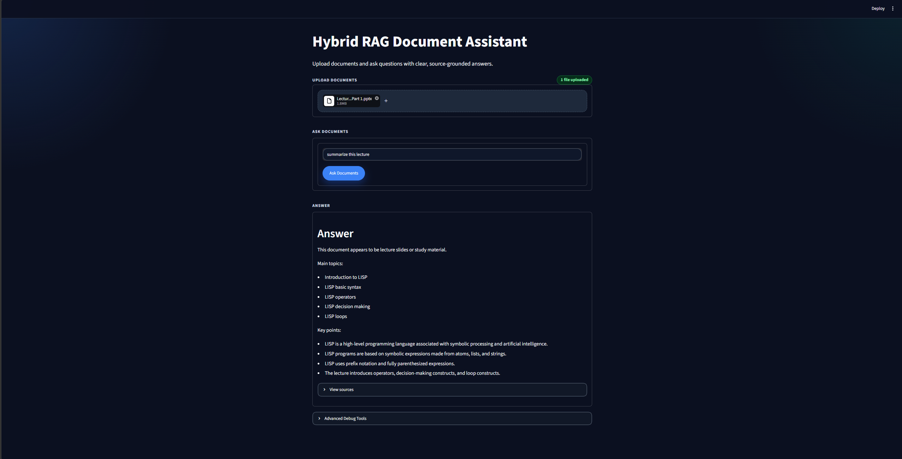
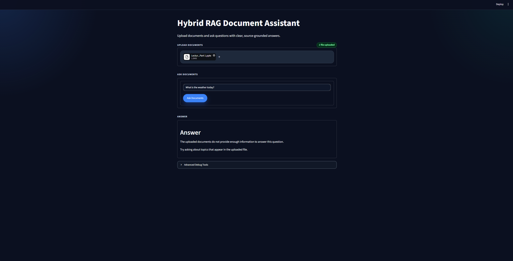
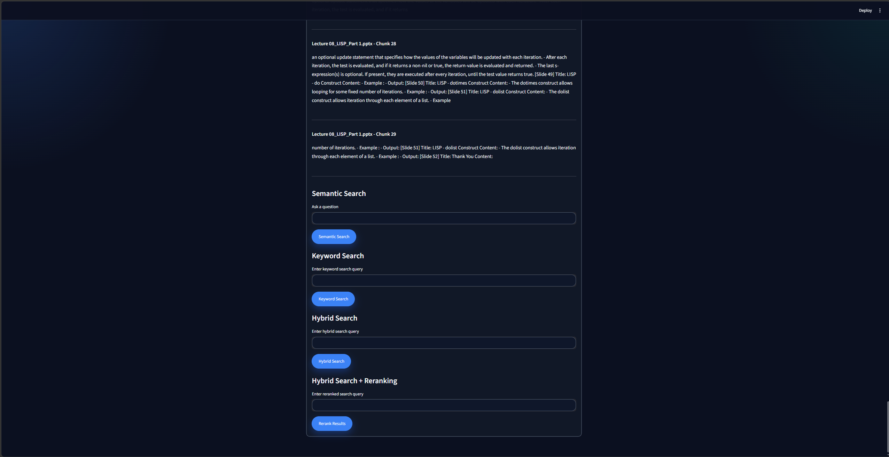

# Hybrid RAG Document Assistant

A professional document-based Retrieval-Augmented Generation (RAG) assistant built with Streamlit. The app supports PDF, DOCX, TXT, and PPTX uploads, extracts document text, retrieves relevant context using hybrid search, and returns clear source-grounded answers.

## Project Overview

Hybrid RAG Document Assistant lets users upload documents and ask natural-language questions about their content. It supports common document formats including PDF, DOCX, TXT, and PPTX, making it useful for reports, resumes, notes, lecture slides, and study material.

The assistant combines semantic retrieval, keyword search, hybrid ranking, reranking, and clean fallback answer generation. It works without any API key in retrieval-only mode, while also supporting optional OpenAI, Claude, and Gemini answer generation when local API keys are provided.

## Key Features

- Upload PDF, DOCX, TXT, and PPTX files
- Text extraction from documents and slides
- Document chunking
- Semantic search with sentence-transformer embeddings
- FAISS vector search
- BM25 keyword search
- Hybrid retrieval
- Cross-Encoder reranking
- Clean Ask Documents interface
- Lecture/PPTX summary mode
- Safe fallback when no API key is available
- Optional OpenAI, Claude, and Gemini providers
- Out-of-document safety handling
- Advanced Debug Tools hidden by default
- Automated smoke tests

## Architecture / Pipeline

```text
Upload Documents
-> Text Extraction
-> Chunking
-> Semantic Search
-> BM25 Keyword Search
-> Hybrid Search
-> Cross-Encoder Reranking
-> Answer Generation / Clean Fallback
-> Source-Grounded Response
```

## Tech Stack

- Python
- Streamlit
- FAISS
- Sentence-Transformers
- Cross-Encoder reranker
- BM25 / rank-bm25
- PyPDF
- python-docx
- python-pptx
- NumPy
- OpenAI API optional
- Anthropic Claude API optional
- Google Gemini API optional

## Project Structure

```text
Hybrid-RAG-Document-Assistant/
|-- app.py
|-- requirements.txt
|-- .env.example
|-- .gitignore
|-- src/
|   |-- chunking.py
|   |-- document_loader.py
|   |-- generator.py
|   |-- hybrid_search.py
|   |-- keyword_search.py
|   |-- reranker.py
|   `-- semantic_search.py
|-- scripts/
|   `-- run_smoke_tests.py
`-- test_documents/
    |-- cv_sample.txt
    |-- lecture_slides_sample.txt
    |-- long_sample.txt
    |-- rag_notes.txt
    |-- report_sample.txt
    `-- sample.txt
```

## Installation

### Windows

```powershell
python -m venv .venv
.venv\Scripts\activate
pip install -r requirements.txt
```

### Mac / Linux

```bash
python -m venv .venv
source .venv/bin/activate
pip install -r requirements.txt
```

## Running the App

```bash
streamlit run app.py
```

Then open the local Streamlit URL shown in your terminal.

## Deployment

This app can be deployed on Streamlit Community Cloud.

Use these deployment settings:

```text
Repository: Hybrid-RAG-Document-Assistant
Branch: main
Main file path: app.py
```

The app works in Retrieval-only mode without any API keys. Optional OpenAI, Claude, or Gemini API keys can be added through Streamlit secrets or a local `.env` file.

Streamlit secrets example:

```toml
OPENAI_API_KEY = "your_openai_api_key_here"
ANTHROPIC_API_KEY = "your_anthropic_api_key_here"
GEMINI_API_KEY = "your_gemini_api_key_here"
```

## Running Smoke Tests

```bash
python scripts/run_smoke_tests.py
```

The smoke tests check imports, document loading, chunking, semantic search, keyword search, hybrid retrieval, reranking, fallback answer generation, lecture summaries, and out-of-document handling.

## Example Questions

- summarize this lecture
- what are the main topics in this file?
- what are embeddings?
- why are citations important in RAG?
- what technical skills are mentioned?
- what is the weather today?

Unrelated questions, such as weather or live external information, should return a safe response explaining that the uploaded documents do not provide enough information.

## Optional LLM Providers

The app works without any API key using a clean retrieval-based fallback answer generator. Retrieval-only mode is the default and requires no paid services.

Optional LLM providers are supported:

- OpenAI
- Claude
- Gemini

Users can choose the answer provider in the Streamlit UI. If a provider is selected but its API key is missing, the app falls back gracefully to the retrieval-based answer.

To configure providers locally, copy `.env.example` to `.env` and fill in only the keys you want to use:

Example `.env` format:

```text
LLM_PROVIDER=none

OPENAI_API_KEY=your_api_key_here
OPENAI_MODEL=gpt-4.1-mini

ANTHROPIC_API_KEY=your_anthropic_api_key_here
ANTHROPIC_MODEL=claude-sonnet-4-5

GEMINI_API_KEY=your_gemini_api_key_here
GEMINI_MODEL=gemini-2.5-flash
```

Model names can be changed in `.env`. Never commit `.env` or real API keys to GitHub.

## Screenshots

Screenshots can be added here:







## Why This Project Matters

This project demonstrates practical AI Engineering skills across the full RAG workflow: document ingestion, text extraction, chunking, semantic search, keyword retrieval, hybrid ranking, reranking, answer generation, source grounding, smoke testing, and safe fallback behavior.

It is designed as a portfolio-ready example of how to build a useful AI assistant while keeping technical complexity hidden from the user-facing interface.

## Resume Bullet

Built a Hybrid RAG Document Assistant that supports PDF, DOCX, TXT, and PPTX ingestion with FAISS semantic search, BM25 keyword retrieval, hybrid ranking, Cross-Encoder reranking, lecture summary mode, source-grounded answers, and automated smoke tests.

## Future Improvements

- Add persistent vector database storage
- Add user authentication
- Add Docker deployment
- Add better PDF page-level citations
- Add local LLM support
- Add evaluation dashboard
