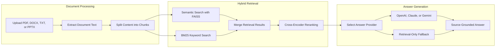
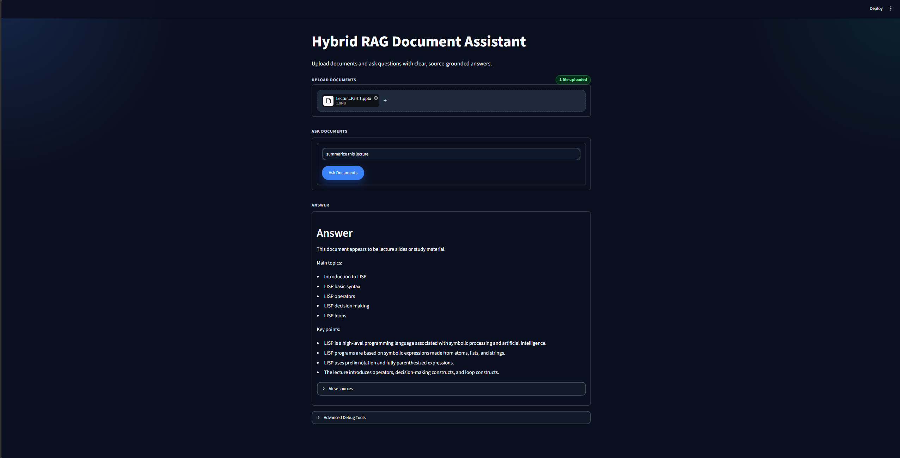
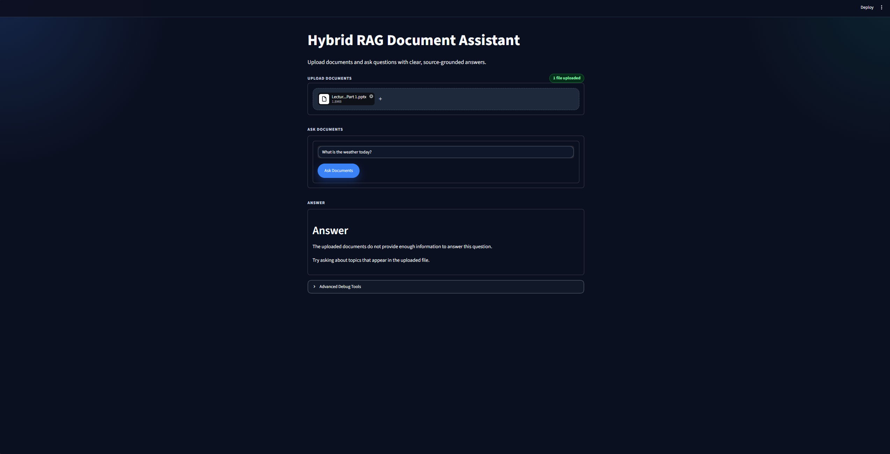
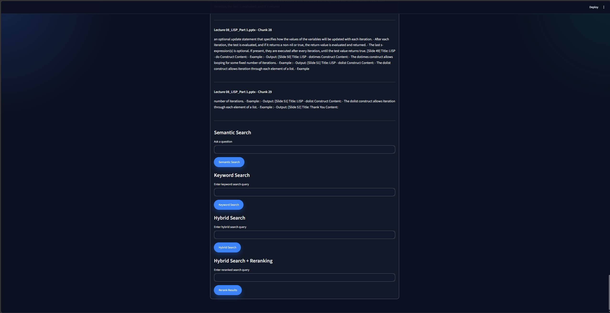

# Hybrid RAG Document Assistant

A multi-provider Retrieval-Augmented Generation application for asking source-grounded questions across PDF, DOCX, TXT, and PPTX documents.


---

## Overview

Hybrid RAG Document Assistant allows users to upload documents and ask natural-language questions about their content.

The system combines semantic vector search, BM25 keyword retrieval, hybrid ranking, and Cross-Encoder reranking to identify the most relevant document sections before generating an answer.

It supports reports, resumes, notes, academic material, presentations, and other document-based knowledge sources.

The application can run entirely without an API key using its retrieval-based fallback mode. Users can also connect OpenAI, Anthropic Claude, or Google Gemini for LLM-generated answers.

---

## Key Features

- Upload multiple PDF, DOCX, TXT, and PPTX files
- Extract text from documents and presentation slides
- Split extracted content into manageable text chunks
- Generate semantic embeddings using Sentence Transformers
- Perform vector similarity search with FAISS
- Perform keyword retrieval with BM25
- Combine semantic and keyword results through hybrid retrieval
- Improve result relevance with Cross-Encoder reranking
- Generate source-grounded answers
- Summarize lectures and presentation files
- Support OpenAI, Claude, and Gemini
- Run without paid APIs using retrieval-only mode
- Fall back automatically when an API key is unavailable
- Reject questions that cannot be answered from the uploaded documents
- Hide technical debugging settings from the default interface
- Validate the main pipeline through automated smoke tests

---

## Demo Workflow

1. Upload one or more supported documents.
2. Wait for the application to extract and index the content.
3. Select an answer provider or use retrieval-only mode.
4. Ask a question about the uploaded documents.
5. Review the generated answer and its supporting sources.

Example questions:

```text
Summarize this lecture.

What are the main topics discussed in this file?

What are embeddings?

Why are citations important in RAG?

What technical skills are mentioned in the resume?
```

Questions that require external or live information, such as weather updates, are rejected when the required information is not available in the uploaded documents.

---

## System Architecture


```mermaid
flowchart LR
    subgraph INGEST["Document Processing"]
        direction TB
        A1[Upload PDF, DOCX, TXT, or PPTX]
        A2[Extract Document Text]
        A3[Split Content into Chunks]

        A1 --> A2 --> A3
    end

    subgraph RETRIEVE["Hybrid Retrieval"]
        direction TB
        B1[Semantic Search with FAISS]
        B2[BM25 Keyword Search]
        B3[Merge Retrieval Results]
        B4[Cross-Encoder Reranking]

        B1 --> B3
        B2 --> B3
        B3 --> B4
    end

    subgraph ANSWER["Answer Generation"]
        direction TB
        C1[Select Answer Provider]
        C2[OpenAI, Claude, or Gemini]
        C3[Retrieval-Only Fallback]
        C4[Source-Grounded Answer]

        C1 --> C2
        C1 --> C3
        C2 --> C4
        C3 --> C4
    end

    A3 --> B1
    A3 --> B2
    B4 --> C1
```

---

## Retrieval Pipeline

### 1. Document ingestion

The application accepts the following file formats:

- PDF
- DOCX
- TXT
- PPTX

Each file is processed using a format-specific document loader.

### 2. Text chunking

Extracted text is divided into smaller chunks so that relevant sections can be retrieved without sending the entire document to the answer generator.

### 3. Semantic retrieval

Sentence Transformer embeddings represent document chunks as vectors. FAISS is then used to retrieve chunks with the highest semantic similarity to the user’s question.

### 4. Keyword retrieval

BM25 identifies chunks containing important terms that may not be ranked highly by semantic similarity alone.

### 5. Hybrid ranking

Semantic and keyword retrieval results are combined into a unified candidate set.

### 6. Reranking

A Cross-Encoder model scores the candidate chunks against the original question and prioritizes the most relevant results.

### 7. Answer generation

The final context is sent either to the selected LLM provider or to the retrieval-based fallback generator.

The resulting answer is grounded in the retrieved document content.

---

## Tech Stack

| Category | Technology |
|---|---|
| Programming language | Python |
| User interface | Streamlit |
| Vector search | FAISS |
| Embeddings | Sentence Transformers |
| Keyword retrieval | BM25 / rank-bm25 |
| Reranking | Cross-Encoder |
| PDF processing | PyPDF |
| Word document processing | python-docx |
| PowerPoint processing | python-pptx |
| Numerical operations | NumPy |
| LLM provider | OpenAI API |
| LLM provider | Anthropic Claude API |
| LLM provider | Google Gemini API |
| Configuration | python-dotenv |
| Testing | Automated smoke-test script |

---

## Project Structure

```text
Hybrid-RAG-Document-Assistant/
├── app.py
├── requirements.txt
├── .env.example
├── .gitignore
│
├── src/
│   ├── chunking.py
│   ├── document_loader.py
│   ├── generator.py
│   ├── hybrid_search.py
│   ├── keyword_search.py
│   ├── reranker.py
│   └── semantic_search.py
│
├── scripts/
│   └── run_smoke_tests.py
│
└── test_documents/
    ├── cv_sample.txt
    ├── lecture_slides_sample.txt
    ├── long_sample.txt
    ├── rag_notes.txt
    ├── report_sample.txt
    └── sample.txt
```

---

## Installation

### 1. Clone the repository

```bash
git clone https://github.com/Azoqoz/Hybrid-RAG-Document-Assistant.git
cd Hybrid-RAG-Document-Assistant
```

### 2. Create a virtual environment

#### Windows

```powershell
python -m venv .venv
.venv\Scripts\activate
```

#### macOS / Linux

```bash
python3 -m venv .venv
source .venv/bin/activate
```

### 3. Install the dependencies

```bash
pip install -r requirements.txt
```

---

## Configuration

The application works without an API key when retrieval-only mode is selected.

To use an external LLM provider, copy the example environment file:

### Windows

```powershell
copy .env.example .env
```

### macOS / Linux

```bash
cp .env.example .env
```

Add only the providers that you intend to use:

```env
LLM_PROVIDER=none

OPENAI_API_KEY=your_openai_api_key
OPENAI_MODEL=gpt-4.1-mini

ANTHROPIC_API_KEY=your_anthropic_api_key
ANTHROPIC_MODEL=claude-sonnet-4-5

GEMINI_API_KEY=your_gemini_api_key
GEMINI_MODEL=gemini-2.5-flash
```

Available provider values:

```text
none
openai
anthropic
gemini
```

Model names can be changed through the `.env` file.

> Never commit a `.env` file or real API keys to GitHub.

---

## Running the Application

Start the Streamlit application:

```bash
streamlit run app.py
```

Streamlit will display a local URL in the terminal, typically:

```text
http://localhost:8501
```

Open the displayed URL in your browser.

---

## Answer Providers

### Retrieval-only mode

Retrieval-only mode is the default option and does not require any paid service or external API key.

The application retrieves relevant document sections and converts them into a structured fallback answer.

### OpenAI

When an OpenAI API key is configured, the retrieved context can be passed to the selected OpenAI model.

### Anthropic Claude

When an Anthropic API key is configured, users can select Claude as the answer-generation provider.

### Google Gemini

When a Gemini API key is configured, users can generate answers using a supported Gemini model.

### Automatic fallback

When a provider is selected but its API key is missing or unavailable, the application returns to retrieval-only mode instead of stopping the workflow.

---

## Safety and Grounding

The application is designed to answer questions using only the uploaded document content.

Its safety behavior includes:

- Detecting questions that are unrelated to the uploaded documents
- Avoiding unsupported answers when relevant context is unavailable
- Returning a clear message when the documents do not contain enough information
- Grounding generated answers in retrieved document chunks
- Preventing API-key failures from breaking the application
- Keeping advanced debugging controls hidden by default

This reduces unsupported responses and keeps the assistant focused on the provided knowledge source.

---

## Running the Tests

Run the automated smoke-test suite with:

```bash
python scripts/run_smoke_tests.py
```

The tests cover the main components of the application, including:

- Module imports
- Document loading
- Text chunking
- Semantic search
- BM25 keyword search
- Hybrid retrieval
- Cross-Encoder reranking
- Retrieval-based answer generation
- Lecture summarization
- Out-of-document question handling

---

## Deployment

The application can be deployed using Streamlit Community Cloud.

Recommended deployment settings:

```text
Repository: Azoqoz/Hybrid-RAG-Document-Assistant
Branch: main
Main file path: app.py
```

For retrieval-only deployment, no API keys are required.

For optional LLM providers, add the required keys through the Streamlit secrets configuration:

```toml
OPENAI_API_KEY = "your_openai_api_key"
ANTHROPIC_API_KEY = "your_anthropic_api_key"
GEMINI_API_KEY = "your_gemini_api_key"
```

Do not store real API keys directly inside the source code or repository.

---

## Screenshots

### Lecture Summary



### Out-of-Document Safety



### Advanced Debug Tools



---

## Current Limitations

- Document indexes are rebuilt when the application session restarts
- Retrieved vectors are not stored in a persistent vector database
- PDF citations do not always include precise page-level references
- Large documents may require additional processing time
- Retrieval-only answers are less flexible than LLM-generated answers
- Local LLM inference is not currently included
- Authentication and user-specific document storage are not implemented

---

## Future Improvements

- Add persistent vector database storage
- Add page-level and slide-level citations
- Add local LLM support through Ollama
- Add user authentication
- Add document collections and saved workspaces
- Add Docker support
- Add automated RAG evaluation metrics
- Add an evaluation and retrieval-quality dashboard
- Add conversational memory for follow-up questions
- Add support for additional document formats

---

## Why This Project Matters

This project demonstrates an end-to-end Retrieval-Augmented Generation workflow rather than relying only on direct LLM prompting.

It covers several practical AI Engineering components:

- Multi-format document ingestion
- Text preprocessing and chunking
- Embedding generation
- Vector similarity search
- Keyword retrieval
- Hybrid search
- Reranking
- Multi-provider LLM integration
- Source-grounded answer generation
- Safe fallback handling
- Automated pipeline testing
- Streamlit application development
- Cloud-ready configuration

The project shows how retrieval quality, provider flexibility, safety behavior, and user experience can be combined into a complete document-question-answering application.

---

## Author

Developed by [Azoqoz](https://github.com/Azoqoz).
