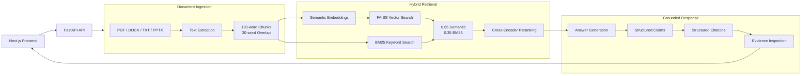

# Hybrid RAG Document Assistant

A full-stack Retrieval-Augmented Generation application for asking source-grounded questions across PDF, DOCX, TXT, and PPTX documents using hybrid retrieval, reranking, structured citations, and inspectable evidence.


---

## Live Application

**Frontend**

https://hybrid-rag-document-assistant-smoky.vercel.app

**Backend API**

https://hybrid-rag-document-assistant-api.onrender.com

**Health Check**

https://hybrid-rag-document-assistant-api.onrender.com/health

> The production backend runs on the Render free tier and may require a short cold start after periods of inactivity.

---

## Overview

Hybrid RAG Document Assistant is a document-question-answering system built to make retrieval and evidence inspection visible rather than hiding the entire RAG pipeline behind a chatbot interface.

Users can upload PDF, DOCX, TXT, and PPTX files, build an in-memory searchable corpus, ask natural-language questions, and inspect the exact document chunks supporting the generated answer.

The retrieval pipeline combines:

- Semantic vector search
- BM25 keyword retrieval
- Weighted hybrid fusion
- Cross-Encoder reranking
- Structured claim-level citations
- Evidence inspection

The current production application uses a **Next.js frontend** connected to a **FastAPI backend**.

For local development, the system uses Sentence Transformers and a PyTorch Cross-Encoder. Production deployment can switch to a lightweight **FastEmbed / ONNX Runtime** backend to operate within constrained cloud memory while preserving the same RAG architecture.

---

## Key Features

- Upload multiple PDF, DOCX, TXT, and PPTX files
- Extract text using format-specific document loaders
- Build a searchable in-memory document corpus
- Split content using overlapping text chunks
- Generate semantic embeddings
- Perform vector similarity search with FAISS
- Perform lexical retrieval with BM25
- Combine semantic and keyword results using `0.65 / 0.35` hybrid weighting
- Rerank the strongest candidates using a Cross-Encoder
- Generate grounded answers from retrieved context
- Return structured answer claims
- Map claims conservatively to supporting citations
- Inspect the exact evidence passage supporting a claim
- Display semantic, BM25, hybrid, and reranking metadata
- Expand surrounding retrieval context
- Support retrieval-only answering without paid APIs
- Support optional OpenAI, Anthropic Claude, and Google Gemini providers
- Recover gracefully when a provider API key is unavailable
- Use a lightweight FastEmbed / ONNX deployment profile
- Keep heavy ML models out of FastAPI startup
- Support responsive desktop, tablet, and mobile layouts
- Provide keyboard-accessible evidence navigation
- Validate the system through automated parity, service, API, contract, low-memory, and deployment-backend tests

---

## Product Workflow

```text
Upload Documents
      ↓
Extract & Chunk
      ↓
Build Searchable Corpus
      ↓
Ask a Question
      ↓
Semantic Search + BM25
      ↓
Hybrid Fusion
      ↓
Cross-Encoder Reranking
      ↓
Grounded Answer
      ↓
Claim-Level Citations
      ↓
Inspect Evidence
```

### Typical workflow

1. Upload one or more supported documents.
2. Wait for extraction, chunking, and indexing to complete.
3. Open **Ask documents**.
4. Enter a question about the indexed corpus.
5. Review the grounded answer.
6. Select a citation such as `A·18`.
7. Inspect the supporting passage in the Evidence Stage.
8. Expand retrieval details when deeper inspection is required.

Example questions:

```text
What Python packages are required by this project?

What are the main topics discussed in this document?

Why does the report recommend this approach?

How are semantic and keyword retrieval combined?

Summarize the indexed corpus.
```

---

## System Architecture


```mermaid
flowchart LR
    UI["Next.js Frontend"]

    API["FastAPI API"]

    subgraph INGEST["Document Ingestion"]
        A1["PDF / DOCX / TXT / PPTX"]
        A2["Text Extraction"]
        A3["120-word Chunks<br/>30-word Overlap"]
        A1 --> A2 --> A3
    end

    subgraph SEARCH["Hybrid Retrieval"]
        B1["Semantic Embeddings"]
        B2["FAISS Vector Search"]
        B3["BM25 Keyword Search"]
        B4["0.65 Semantic<br/>0.35 BM25"]
        B5["Cross-Encoder Reranking"]

        B1 --> B2
        B2 --> B4
        B3 --> B4
        B4 --> B5
    end

    subgraph ANSWER["Grounded Response"]
        C1["Answer Generation"]
        C2["Structured Claims"]
        C3["Structured Citations"]
        C4["Evidence Inspection"]

        C1 --> C2
        C2 --> C3
        C3 --> C4
    end

    UI --> API
    API --> INGEST
    A3 --> B1
    A3 --> B3
    B5 --> C1
    C4 --> UI
```

---

## Retrieval Pipeline

### 1. Document ingestion

The application accepts:

- PDF
- DOCX
- TXT
- PPTX

Each format uses a dedicated extraction path.

PDF files are processed with PyPDF, DOCX files through `python-docx`, and PPTX files through `python-pptx`.

---

### 2. Text chunking

Extracted text is divided into overlapping word windows.

Current configuration:

```text
Chunk size: 120 words
Overlap: 30 words
```

Each chunk receives a stable corpus chunk ID used throughout retrieval and citation generation.

---

### 3. Semantic retrieval

The local inference backend uses:

```text
sentence-transformers/all-MiniLM-L6-v2
```

The resulting embeddings are normalized and stored in a FAISS `IndexFlatIP` index.

With normalized vectors, inner-product search provides cosine-style semantic similarity.

---

### 4. Keyword retrieval

BM25 retrieval uses `BM25Okapi` to identify passages containing exact terminology that semantic similarity may underweight.

This is especially useful for:

- Technical terminology
- Proper nouns
- Version numbers
- Acronyms
- Exact document language

---

### 5. Hybrid fusion

Semantic and BM25 results are normalized independently and combined using:

```text
Semantic weight: 0.65
BM25 weight:     0.35
```

The strongest ten hybrid candidates continue to reranking.

---

### 6. Cross-Encoder reranking

The local backend uses:

```text
cross-encoder/ms-marco-MiniLM-L-6-v2
```

The Cross-Encoder evaluates each question-passage pair directly and reorders the hybrid candidate set.

The top five reranked passages continue into answer generation.

---

### 7. Grounded answer generation

The default provider is:

```text
none
```

This mode requires no API key and produces a deterministic retrieval-based answer.

Optional backend providers include:

- OpenAI
- Anthropic Claude
- Google Gemini

Missing provider credentials automatically fall back to retrieval-only behavior.

---

### 8. Claims and citations

Answers are converted into structured claims.

Example:

```json
{
  "claim_id": "claim-001",
  "text": "BM25 preserves exact technical terminology.",
  "citation_ids": [
    "citation-000018"
  ],
  "support_status": "evidence_match"
}
```

Citation relationships are created conservatively.

If the available evidence does not sufficiently match a claim, the system leaves the citation list empty instead of fabricating a source connection.

---

### 9. Evidence inspection

The frontend converts backend citation IDs into compact display labels such as:

```text
A·18
B·07
C·04
```

Selecting a citation opens the Evidence Stage, which can expose:

- Source filename
- Chunk ID
- Evidence snippet
- Surrounding retrieved context
- Semantic score
- BM25 score
- Hybrid score
- Reranker score
- Rerank position

Retrieval scores are labeled independently because the different scoring methods do not share a guaranteed comparable scale.

---

## Local and Production Inference

The project provides two inference backends.

### Local / Full Development

Default:

```env
RAG_INFERENCE_BACKEND=sentence_transformers
```

Uses:

| Task | Model |
|---|---|
| Embeddings | `sentence-transformers/all-MiniLM-L6-v2` |
| Reranking | `cross-encoder/ms-marco-MiniLM-L-6-v2` |
| Runtime | Sentence Transformers / PyTorch |

This is the default development configuration.

---

### Production / Low-Memory Deployment

Render deployment uses:

```env
RAG_INFERENCE_BACKEND=fastembed
LOW_MEMORY_MODE=true
```

Models:

| Task | Model |
|---|---|
| Embeddings | `sentence-transformers/all-MiniLM-L6-v2` |
| Reranking | `Xenova/ms-marco-MiniLM-L-6-v2` |
| Runtime | FastEmbed / ONNX Runtime |

The ONNX deployment backend avoids loading PyTorch on the constrained Render instance while preserving the same retrieval architecture.

Minor floating-point score differences between the PyTorch and ONNX runtimes are expected.

---

## Tech Stack

| Category | Technology |
|---|---|
| Frontend | Next.js 16 |
| Frontend language | TypeScript |
| Backend | FastAPI |
| Backend language | Python |
| Vector search | FAISS |
| Keyword retrieval | BM25 / rank-bm25 |
| Local embeddings | Sentence Transformers |
| Production embeddings | FastEmbed / ONNX Runtime |
| Local reranking | Cross-Encoder |
| Production reranking | FastEmbed TextCrossEncoder |
| PDF processing | PyPDF |
| Word processing | python-docx |
| PowerPoint processing | python-pptx |
| Numerical operations | NumPy |
| OpenAI integration | OpenAI API |
| Claude integration | Anthropic API |
| Gemini integration | Google GenAI |
| Configuration | python-dotenv |
| Backend deployment | Render |
| Frontend deployment | Vercel |
| Testing | pytest |
| Legacy interface | Streamlit |

---

## Project Structure

```text
Hybrid-RAG-Document-Assistant/
├── app.py
├── DESIGN.md
├── requirements.txt
├── requirements-render.txt
├── .env.example
├── .gitignore
│
├── frontend/
│   ├── .env.example
│   ├── package.json
│   ├── next.config.ts
│   ├── tsconfig.json
│   │
│   └── src/
│       ├── app/
│       │   ├── layout.tsx
│       │   ├── page.tsx
│       │   └── globals.css
│       │
│       ├── lib/
│       │   └── rag-api.ts
│       │
│       └── components/
│           └── rag-workspace/
│               ├── RagWorkspace.tsx
│               ├── DocumentsMode.tsx
│               ├── DocumentSlab.tsx
│               ├── QuestionComposer.tsx
│               ├── GroundedAnswer.tsx
│               ├── ClaimRow.tsx
│               ├── EvidenceFlag.tsx
│               ├── EvidenceStage.tsx
│               ├── RetrievalDisclosure.tsx
│               ├── adapters.ts
│               ├── suggestions.ts
│               └── types.ts
│
├── src/
│   ├── api/
│   │   ├── app.py
│   │   └── schemas.py
│   │
│   ├── services/
│   │   ├── claims.py
│   │   ├── contracts.py
│   │   ├── corpus.py
│   │   ├── ingestion.py
│   │   ├── inference_backends.py
│   │   ├── model_registry.py
│   │   ├── provider.py
│   │   ├── query.py
│   │   └── retrieval.py
│   │
│   ├── chunking.py
│   ├── document_loader.py
│   ├── generator.py
│   ├── hybrid_search.py
│   ├── keyword_search.py
│   ├── reranker.py
│   └── semantic_search.py
│
└── tests/
    ├── test_api.py
    ├── test_phase1_parity.py
    ├── test_phase2_services.py
    ├── test_phase35_contract.py
    ├── test_low_memory_mode.py
    └── test_fastembed_backend.py
```

`app.py` is retained as the original Streamlit implementation and development history. The production application uses the Next.js + FastAPI architecture.

---

## Installation

### 1. Clone the repository

```bash
git clone https://github.com/Azoqoz/Hybrid-RAG-Document-Assistant.git
cd Hybrid-RAG-Document-Assistant
```

### 2. Create a Python virtual environment

#### Windows

```powershell
python -m venv .venv
.venv\Scripts\activate
```

#### macOS / Linux

```bash
python3 -m venv .venv
source .venv/bin/activate
```

### 3. Install backend dependencies

```bash
pip install -r requirements.txt
```

### 4. Install frontend dependencies

```bash
cd frontend
npm install
cd ..
```

---

## Configuration

### Backend

Copy the example environment file:

#### Windows

```powershell
copy .env.example .env
```

#### macOS / Linux

```bash
cp .env.example .env
```

Default local configuration can run without an external LLM API key.

Example:

```env
LLM_PROVIDER=none

RAG_INFERENCE_BACKEND=sentence_transformers
LOW_MEMORY_MODE=false

OPENAI_API_KEY=
OPENAI_MODEL=gpt-4.1-mini

ANTHROPIC_API_KEY=
ANTHROPIC_MODEL=claude-sonnet-4-5

GEMINI_API_KEY=
GEMINI_MODEL=gemini-2.5-flash
```

Available provider values:

```text
none
openai
anthropic
gemini
```

---

### Frontend

Create:

```text
frontend/.env.local
```

Add:

```env
NEXT_PUBLIC_API_BASE_URL=http://127.0.0.1:8000
```

> Never commit `.env`, `.env.local`, or real API keys to GitHub.

---

## Running the Application

The production-style local workflow runs the FastAPI backend and Next.js frontend separately.

### 1. Start FastAPI

From the project root:

```bash
python -m uvicorn src.api.app:app --reload --port 8000
```

Backend:

```text
http://127.0.0.1:8000
```

Health check:

```text
http://127.0.0.1:8000/health
```

---

### 2. Start Next.js

Open a second terminal:

```bash
cd frontend
npm run dev
```

Frontend:

```text
http://localhost:3000
```

---

## API

Main endpoints:

```text
GET    /health
POST   /corpora
GET    /corpora/{corpus_id}
DELETE /corpora/{corpus_id}

POST   /corpora/{corpus_id}/documents
POST   /corpora/{corpus_id}/query
```

### Corpus lifecycle

A frontend session creates an in-memory corpus.

Documents are then uploaded to that corpus and indexed.

Because corpus state is currently memory-only, restarting the backend invalidates existing corpus IDs. The frontend detects missing corpora and creates a new workspace automatically.

---

## Answer Providers

### Retrieval-only

Default behavior:

```text
provider = none
```

No external API key is required.

The application converts retrieved evidence into a deterministic grounded answer.

---

### OpenAI

The backend can generate answers through the OpenAI Responses API when configured.

Default model:

```text
gpt-4.1-mini
```

---

### Anthropic Claude

Anthropic Messages API support is available when an API key is configured.

Default model:

```text
claude-sonnet-4-5
```

---

### Google Gemini

Gemini answer generation is also supported.

Default model:

```text
gemini-2.5-flash
```

---

### Automatic fallback

If a configured provider is unavailable or its API key is missing, the system returns to retrieval-only answering instead of breaking the workflow.

The current production frontend defaults to retrieval-only mode.

---

## Safety and Grounding

The application is designed around evidence-first answering.

Grounding behavior includes:

- Restricting answers to uploaded corpus content
- Retrieving evidence before answer generation
- Preserving source filenames and chunk identities
- Returning structured citations
- Mapping claims only when sufficient evidence overlap exists
- Leaving unsupported claims uncited rather than inventing references
- Exposing the exact evidence passage used
- Providing retrieval and reranking metadata for inspection
- Recovering from unavailable external providers
- Recovering from expired in-memory corpus IDs
- Avoiding fabricated page or slide numbers when metadata is unavailable

This keeps the application focused on the supplied knowledge source and makes its retrieval behavior inspectable.

---

## Running the Tests

Run the complete test suite with:

```bash
python -m pytest --basetemp=.pytest_tmp -p no:cacheprovider
```

Current result:

```text
52 passed
0 failed
```

The test suite covers:

- Original pipeline parity
- Document ingestion
- Text chunking
- Semantic retrieval
- BM25 retrieval
- Hybrid fusion
- Cross-Encoder reranking
- Framework-neutral RAG services
- Corpus lifecycle
- FastAPI endpoints
- Structured claims
- Structured citations
- Query response contracts
- Missing-provider fallback
- Low-memory model lifecycle
- Lightweight FastAPI startup
- FastEmbed inference backend
- ONNX deployment compatibility

Frontend validation also passes:

```bash
cd frontend
npm run lint
npm run build
```

---

## Deployment

The application is deployed as two independent services.

### Frontend — Vercel

Production URL:

```text
https://hybrid-rag-document-assistant-smoky.vercel.app
```

Configuration:

```text
Framework: Next.js
Root Directory: frontend
```

Environment:

```env
NEXT_PUBLIC_API_BASE_URL=https://hybrid-rag-document-assistant-api.onrender.com
```

---

### Backend — Render

Production API:

```text
https://hybrid-rag-document-assistant-api.onrender.com
```

Build command:

```bash
pip install -r requirements-render.txt
```

Start command:

```bash
python -m uvicorn src.api.app:app --host 0.0.0.0 --port $PORT
```

Production environment:

```env
LOW_MEMORY_MODE=true
RAG_INFERENCE_BACKEND=fastembed
TOKENIZERS_PARALLELISM=false
OMP_NUM_THREADS=1
CORS_ALLOWED_ORIGINS=https://hybrid-rag-document-assistant-smoky.vercel.app
```

`requirements-render.txt` intentionally excludes:

```text
torch
sentence-transformers
streamlit
```

This keeps the production backend lightweight enough to operate using FastEmbed and ONNX Runtime.

> Render free instances can spin down after inactivity, so the first request after a cold start may take additional time.

---

## Current Limitations

- Corpus and FAISS indexes are stored in application memory
- Backend restarts remove uploaded corpora
- Multi-user persistent storage is not implemented
- Authentication is not currently included
- PDF citations do not yet guarantee precise page-level references
- DOCX paragraph-level coordinates are not currently exposed
- Scanned PDFs do not use OCR
- Complex tables are not extracted structurally
- Large document collections can require additional indexing time
- Render free instances introduce cold-start latency
- Retrieval-only answers are less flexible than LLM-generated answers
- Production and local inference runtimes may produce small floating-point score differences

---

## Future Improvements

- Add persistent corpus and vector-index storage
- Add user authentication
- Add private document workspaces
- Add page-level PDF citations
- Add slide-level presentation coordinates
- Add OCR for scanned PDFs
- Improve table extraction
- Add saved document collections
- Add conversational follow-up memory
- Add streaming answer generation
- Add retrieval-quality evaluation metrics
- Add automated RAG regression benchmarks
- Add richer provider selection in the production frontend
- Add Docker support
- Add persistent deployment storage

---

## Why This Project Matters

Hybrid RAG Document Assistant demonstrates more than a basic document chatbot.

The project covers a complete AI Engineering workflow:

- Multi-format document ingestion
- Chunking and preprocessing
- Embedding generation
- FAISS vector retrieval
- BM25 lexical retrieval
- Hybrid search
- Cross-Encoder reranking
- Structured claim generation
- Claim-level citation mapping
- Evidence inspection
- Multi-provider answer generation
- Framework-neutral service architecture
- REST API design with FastAPI
- Full-stack integration with Next.js
- Low-memory inference lifecycle management
- PyTorch and ONNX inference backends
- Production deployment on Vercel and Render
- Automated parity and regression testing

The system makes retrieval evidence visible to the user and demonstrates how RAG quality, explainability, deployment constraints, and full-stack product design can be combined into one production application.

---

## Author

Developed by [Azoqoz](https://github.com/Azoqoz).
